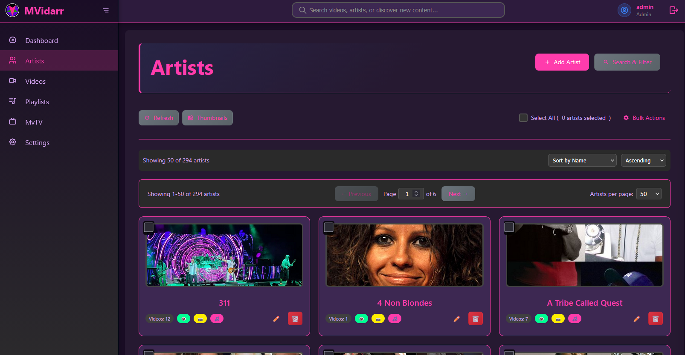

# MVidarr

**A comprehensive music video management and discovery platform** that helps you organize, discover, and stream your music video collection with intelligent artist management and advanced search capabilities.



## ✨ Key Features

- **🎯 Advanced Artist Management** - Multi-criteria search and bulk operations
- **🔍 Comprehensive Video Discovery** - Dual-source integration (IMVDb + YouTube)  
- **🖼️ Advanced Thumbnail Management** - Multi-source search and cropping
- **📁 Intelligent Organization** - Automatic folder creation and cleanup
- **🔎 Advanced Search System** - Real-time suggestions and filtering
- **⚡ Bulk Operations** - Multi-select editing and batch processing
- **📺 Video Streaming** - Built-in player with transcoding support
- **💚 System Health Monitoring** - Comprehensive diagnostics
- **⚙️ Database-Driven Settings** - Complete configuration management
- **📥 Download Management** - Queue visualization and progress tracking
- **🎨 Modern UI** - Left sidebar navigation with theme system
- **📺 MvTV Continuous Player** - Cinematic mode for uninterrupted viewing
- **🎭 Genre Management** - Automatic genre tagging and filtering
- **🔐 User Authentication** - Role-based access control with security features
- **🎨 Advanced Theme System** - 7 built-in themes with export/import functionality

## 🚀 **LATEST: v0.11.7 - Video Filtering, Extended Discovery & Blacklist Fix**

**Released**: February 2, 2026

> **Note**: This is a pre-production release following SemVer 0.x conventions. The software is feature-complete but undergoing testing and validation before the official v1.0.0 production release.

### Per-Artist Video Type Filtering ✅ (Issue #191)
- **🎛️ Video Type Selection**: Users can now specify which video types to download per artist
- **📋 Supported Types**: Official Video, Official Music Video, Live, Lyric Video, Lyrics, Other
- **🔄 Autodownload Integration**: Filtering preferences respected during automatic video discovery
- **☑️ Flexible Configuration**: Checkbox/multiselect options for granular control

### Extended Video Discovery ✅
- **🎬 Live Performances**: YouTube discovery now finds live performances, concerts, acoustic versions
- **🔍 Multi-Search Strategy**: Bypasses YouTube Music category limitations for better results
- **📈 Increased Discovery**: Default max_videos_per_discovery increased from 5 to 50

### API Optimization ✅
- **⚡ Performance Improvements**: Optimized API endpoints for faster response times
- **🗄️ Streamlined Queries**: Improved database queries and response handling
- **📊 Better Resource Usage**: Enhanced efficiency in API request processing

### Critical Bug Fixes ✅ (Issue #190)
- **🚫 Blacklist Persistence**: Fixed blacklist not saving when deleting videos with 'Add to blacklist' option
- **🔧 Download Callback**: Fixed download completion callback not updating records
- **📊 Download History**: Fixed Download History not showing completed downloads

## 🎯 Previous Releases

### v0.11.6 - Blacklist POST Hotfix (January 2, 2026)
- Fixed non-existent fields from blacklist POST endpoint
- Blacklist API/model mismatch fixes
- Pagination fixes

### v0.11.0 - Scheduler V2 Release
- Database-driven scheduling with web UI management
- Code cleanup & optimization (71.4% size reduction)
- Security hardening (30 issues fixed)
- Docker architecture simplification (3-container deployment)

### v0.9.8 - Subtitle System & User Testing Fixes
- Complete subtitle implementation (WebVTT, SRT, ASS, SSA, SUB)
- Smart YouTube language resolution
- User testing fixes (8/8 critical issues resolved)
- 100% Flask to FastAPI migration complete

## 🚀 Quick Start

### Docker Deployment (Recommended)

**Simple 3-Container Architecture:**
- **mvidarr** - FastAPI application + Celery worker (managed by supervisord)
- **mariadb** - Database
- **redis** - Cache and job queue

**Installation Steps:**

1. **Clone the repository:**
   ```bash
   git clone https://github.com/prefect421/mvidarr.git
   cd mvidarr
   ```

2. **Create your environment file:**
   ```bash
   cp .env.example .env
   ```

3. **Edit .env with your configuration:**
   ```bash
   nano .env  # or use your preferred editor
   ```

   **Required settings:**
   - `DB_PASSWORD` - Set a secure database password
   - `MYSQL_ROOT_PASSWORD` - Set a secure root password
   - `SECRET_KEY` - Generate with: `openssl rand -hex 32`
   - `MUSIC_VIDEOS_PATH` - Path to your music video collection

4. **Start MVidarr:**
   ```bash
   docker-compose up -d
   ```

5. **Access the application:**
   - Open your browser to `http://localhost:5000`
   - Default login: `admin` / `admin` (change immediately)
   - Complete the first-run setup wizard

**Docker Images:**
- **Latest:** `ghcr.io/prefect421/mvidarr:latest`
- **Specific version:** `ghcr.io/prefect421/mvidarr:v0.11.7`

**What's Running:**
- All background jobs (Celery) run automatically inside the main container
- Supervisord manages both FastAPI and Celery processes
- Simple, efficient, and optimized for home users

### Manual Installation

**Prerequisites:**
- Python 3.12+
- MariaDB 11.4+ (recommended)
- FFmpeg (for video processing)

**Installation:**
```bash
# Clone and setup
git clone https://github.com/prefect421/mvidarr.git
cd mvidarr
python -m venv venv
source venv/bin/activate  # On Windows: venv\Scripts\activate
pip install -r requirements.txt

# Start FastAPI application
python fastapi_app.py
```

**Production Service:**
```bash
# Install as systemd service (recommended)
sudo cp mvidarr.service /etc/systemd/system/
sudo systemctl daemon-reload
sudo systemctl enable mvidarr.service
sudo systemctl start mvidarr.service

# Check service status
sudo systemctl status mvidarr.service
```

**Access:** `http://localhost:5000`

## 📚 Documentation

### Getting Started
- **[Installation Guide](docs/installation.md)** - Docker, Manual, and Unraid installation
- **[Unraid Installation](docs/UNRAID_INSTALLATION.md)** - Complete Unraid setup guide
- **[User Guide](docs/USER-GUIDE.md)** - Feature documentation and tutorials
- **[Configuration Guide](docs/CONFIGURATION_GUIDE.md)** - Settings and customization
- **[Troubleshooting](docs/TROUBLESHOOTING.md)** - Common issues and solutions

### Advanced Topics
- **[API Documentation](docs/API_DOCUMENTATION.md)** - REST API reference and OpenAPI docs
- **[Deployment Guide](DEPLOYMENT_GUIDE.md)** - Production deployment with background jobs
- **[Docker Optimization](docs/DOCKER_OPTIMIZATION_GUIDE.md)** - Container optimization
- **[Security Implementation](docs/SECURITY_IMPLEMENTATION.md)** - Security features
- **[Architecture](docs/ARCHITECTURE.md)** - System architecture and design

## 🏗️ Architecture

MVidarr is built with modern, high-performance architecture:

- **Backend**: **FastAPI** (Python 3.12+) with async operations and advanced features
- **API Layer**: Comprehensive FastAPI with versioning, request logging, and auto-generated clients
- **Template System**: Async Jinja2 templates with performance optimization and caching
- **WebSocket Support**: Native FastAPI WebSockets for real-time features
- **Background Jobs**: **Celery + Redis** for reliable metadata enrichment and processing
- **Database**: MariaDB 11.4+ with async connection pooling and optimization
- **Frontend**: Modern HTML5/CSS3/JavaScript with ES6+ async patterns
- **Performance**: Multi-layer caching (Memory + Redis), compression, and optimization
- **Testing**: Enterprise-grade validation and load testing frameworks
- **Media Processing**: FFmpeg, yt-dlp for video downloading and processing
- **Authentication**: Secure user management with role-based access control
- **Security**: bcrypt password hashing, session management, audit logging
- **Containerization**: Optimized Docker Compose with multi-stage builds, automated monitoring, and 1.41GB production images

## 🔧 Configuration

Configuration is managed through:
- Database settings (preferred for production)
- Environment variables
- Docker Compose environment files

Key environment variables:
```bash
# Database
DB_HOST=mariadb
DB_PASSWORD=secure_password
SECRET_KEY=your-secret-key

# External APIs
IMVDB_API_KEY=your-imvdb-key
YOUTUBE_API_KEY=your-youtube-key

# Background Jobs (New!)
REDIS_URL=redis://redis:6379/0
CELERY_BROKER_URL=redis://redis:6379/0
BACKGROUND_JOBS_ENABLED=true
```

## 🛡️ Security

MVidarr includes comprehensive security features:

- **Multi-user authentication** with role-based access (Admin, Manager, User, ReadOnly)
- **Secure password hashing** with bcrypt
- **Session management** with secure tokens and expiration
- **Account lockout** protection against brute force attacks
- **Password reset** functionality with secure tokens
- **Audit logging** for user actions and system events
- **SQL injection prevention** with parameterized queries and ORM
- **Docker security** with non-root containers and isolated networking

## 🎯 Use Cases

- **Personal Music Video Collections** - Organize and stream your collection
- **Music Discovery** - Find new videos through integrated search
- **Media Center Integration** - Works with Plex and other media servers
- **Home Entertainment** - MvTV mode for continuous viewing
- **Music Research** - Advanced search and filtering capabilities

## 🤝 Contributing

We welcome contributions! Please see our [Contributing Guide](CONTRIBUTING.md) for details.

### Development Setup

1. Fork the repository
2. Create a virtual environment: `python -m venv venv`
3. Activate it: `source venv/bin/activate` (Linux/macOS) or `venv\Scripts\activate` (Windows)
4. Install dev dependencies: `pip install -r requirements.txt`
5. Run tests: `pytest`

## 📄 License

This project is licensed under the MIT License - see the [LICENSE](LICENSE) file for details.

## 🙏 Acknowledgments

- **yt-dlp** - Video download and processing
- **IMVDb** - Music video metadata database
- **YouTube API** - Video discovery and streaming
- **Flask** - Web framework
- **MariaDB** - Database engine

## 📞 Support

- **Documentation**: Check the [docs/](docs/) directory
- **Issues**: Report bugs via GitHub Issues
- **Community**: Join our discussions

---

**MVidarr v0.11.7** - Built with ❤️ for music video enthusiasts
